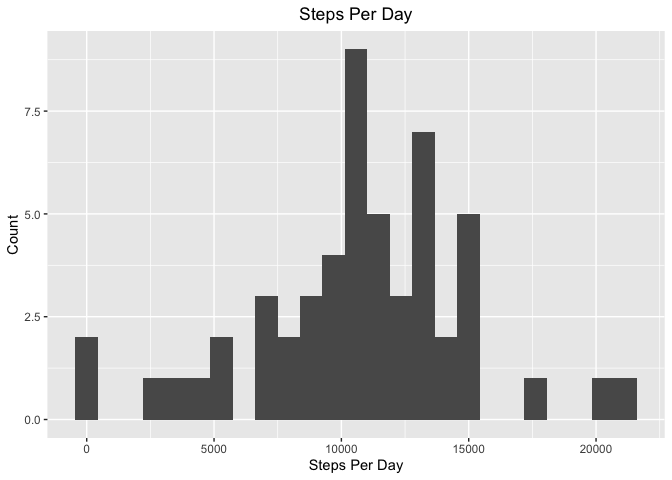

## Loading and preprocessing the data

Load libraries

```r
library(tidyverse)
```

Load the data

```r
activity <- read_csv("activity.csv")
```

Change steps and intervals to integer data and take a quick look

```r
activity <- activity %>% 
    mutate(interval = as.integer(interval)) %>% 
    mutate(steps = as.integer(steps)) %>% 
    filter(!is.na(steps)) %>% # completely removing rows with NA will help for later calculations of means and medians
    glimpse()
```

```
## Rows: 15,264
## Columns: 3
## $ steps    <int> 0, 0, 0, 0, 0, 0, 0, 0, 0, 0, 0, 0, 0, 0, 0, 0, 0, 0, 0, 0, …
## $ date     <date> 2012-10-02, 2012-10-02, 2012-10-02, 2012-10-02, 2012-10-02,…
## $ interval <int> 0, 5, 10, 15, 20, 25, 30, 35, 40, 45, 50, 55, 100, 105, 110,…
```


## What is mean total number of steps taken per day?

We first need to split the data by day


```r
activityByDay <- split(activity, activity$date)
```

Next we need to calculate the total number of steps taken each day while removing NA values


```r
stepsPerDay <- sapply(activityByDay, function(x) sum(x[[1]], na.rm = TRUE))
stepsPerDay <- as.data.frame(stepsPerDay)
head(stepsPerDay)
```

```
##            stepsPerDay
## 2012-10-02         126
## 2012-10-03       11352
## 2012-10-04       12116
## 2012-10-05       13294
## 2012-10-06       15420
## 2012-10-07       11015
```

Next we can view the distrubtion of steps per day with a histogram


```r
ggplot(stepsPerDay, aes(x = stepsPerDay)) +
    geom_histogram(bins = 25) +
    ggtitle("Steps Per Day") +
    theme(plot.title = element_text(hjust = 0.5)) +
    xlab("Steps Per Day") +
    ylab("Count")
```

<!-- -->

We can also calculate measures of center with the mean and median steps per day


```r
mean(stepsPerDay$stepsPerDay) # mean
```

```
## [1] 10766.19
```

```r
median(stepsPerDay$stepsPerDay) # median
```

```
## [1] 10765
```

## What is the average daily activity pattern?

We will start by grouping the data by interval and then taking the mean of each intveral


```r
stepsByInterval <- activity %>% 
    group_by(interval) %>% 
    summarize(meanSteps = mean(steps), medianSteps = median(steps))
```

```
## `summarise()` ungrouping output (override with `.groups` argument)
```

```r
head(stepsByInterval)
```

```
## # A tibble: 6 x 3
##   interval meanSteps medianSteps
##      <int>     <dbl>       <int>
## 1        0    1.72             0
## 2        5    0.340            0
## 3       10    0.132            0
## 4       15    0.151            0
## 5       20    0.0755           0
## 6       25    2.09             0
```
Next, we will plot the invertals on the x axis and the average number of steps in that inverval across all days on the y axis


```r
ggplot(stepsByInterval) +
    geom_line(aes(x=interval, y=meanSteps)) +
    ggtitle("Average Steps Per Day for Each 5-minute Inverval")+
    theme(plot.title = element_text(hjust = 0.5)) +
    xlab("Interval") +
    ylab("Average Steps During Inverval")
```

<!-- -->

The interval with the greatest number of steps, on average, is the 835th interval


```r
which(stepsByInterval$meanSteps == max(stepsByInterval$meanSteps))
```

```
## [1] 104
```

```r
stepsByInterval[104,]
```

```
## # A tibble: 1 x 3
##   interval meanSteps medianSteps
##      <int>     <dbl>       <int>
## 1      835      206.          19
```

## Imputing missing values

Given that we removed quite a few NA values, it's possible this would lead to bias results. Let's calculate how many rows we removed previously.


```r
activity <- read_csv("activity.csv")
sum(apply(activity, MARGIN = 1, anyNA))
```

```
## [1] 2304
```
We should impute some data. To determine which data we should impute, let's compare the mean and median steps within a given interval.


```r
activity <- activity %>% 
    mutate(interval = as.integer(interval)) %>% 
    mutate(steps = as.integer(steps)) %>% 
    filter(!is.na(steps))

stepsByInterval <- activity %>% 
    group_by(interval) %>% 
    summarize(meanSteps = mean(steps), medianSteps = median(steps))
```

```
## `summarise()` ungrouping output (override with `.groups` argument)
```

```r
ggplot(stepsByInterval) +
    geom_line(aes(x=interval, y=meanSteps, color = "blue")) +
    geom_line(aes(x=interval, y=medianSteps, color = "red")) +
    theme(plot.title = element_text(hjust = 0.5)) +
    labs(title = "Mean and Median Steps Per Day for Each 5-minute Inverval",
         x = "Interval", y = "Steps During Interval", color = "Measure") +
    scale_color_manual(labels = c("Mean", "Median"), values = c("red", "blue"))
```

<!-- -->

The median and the mean for each interval are very different. Often, the median value is 0. Imputing with the median will likely be a vast underestimate. The mean and median steps across the entire dataset is 10766.19 and 10765, respectively. Those are remarkably similar, suggesting that the data isn't skewed much when considering an entire day of data. However, the sums of the average and median steps per interval are dramatically different


```r
sum(stepsByInterval$meanSteps)
```

```
## [1] 10766.19
```

```r
sum(stepsByInterval$medianSteps)
```

```
## [1] 1141
```

Given that the sum of the median steps per interval is much lower than the sum of the mean steps per interval, we suggest the mean is a more accurate way to impute the data. Using the mean value may be somewhat of an overestimate of activity, but we feel that it is a better estimate than the median; the median appears to be a large underestimate of activity. Finally, the median may underestimate activity because the person may not have been wearing their activity tracker at all times. It is like that they were moving during these times while not wearing the tracker.

We can impute the mean values with the following for loop. This for loop checks if a step value is NA. If if there is an NA value, it records what interval the NA value was associated with. Then, it find which row the stepsByInterval dataframe contains that same interval value. If finally replaces NA value with the average step value from the stepsByInterval dataframe.


```r
activity.imputed <- read_csv("activity.csv")

for(i in 1:nrow(activity.imputed)) {
    if(is.na(activity.imputed[i,1])) {
        interval <- activity.imputed[[3]][[i]]
        row <- which(stepsByInterval[[1]] == interval)
        activity.imputed[i,1] <- stepsByInterval[row,2]
    }
}
```

We can calculate the number of steps taken each day with tapply


```r
imputedStepsPerDay <- tapply(activity.imputed$steps, activity.imputed$date, sum)
imputedStepsPerDay <- as.data.frame(imputedStepsPerDay)
head(imputedStepsPerDay)
```

```
##            imputedStepsPerDay
## 2012-10-01           10766.19
## 2012-10-02             126.00
## 2012-10-03           11352.00
## 2012-10-04           12116.00
## 2012-10-05           13294.00
## 2012-10-06           15420.00
```

Here's a histogram of the imputed steps per day


```r
ggplot(imputedStepsPerDay) +
    geom_histogram(aes(x = imputedStepsPerDay)) +
    labs(title = "Imputed Steps Per Day", x = "Steps", y = "Frequency") +
    theme(plot.title = element_text(hjust = 0.5))
```

<!-- -->

We can now calculate the mean and median steps per day after imputing the data


```r
mean(imputedStepsPerDay$imputedStepsPerDay)
```

```
## [1] 10766.19
```

```r
median(imputedStepsPerDay$imputedStepsPerDay)
```

```
## [1] 10766.19
```

The mean after imputation equals the mean prior to imputation. The imputed median now equals the imputed mean. As before, these values are very similar to one another.

## Are there differences in activity patterns between weekdays and weekends?

We will use the original, non-imputed data for this analysis


```r
activity <- read_csv("activity.csv")

activity.complete <- activity %>% 
    mutate(interval = as.integer(interval)) %>% 
    mutate(steps = as.integer(steps)) %>% 
    filter(!is.na(steps))
```

The chron library has a very handy function for determining if a date corresponds to a weekend or weekday. We will load chron, create a 'weekend' variable, and then summarize by weekend vs. weekday and interval.


```r
library(chron) # for the is.weekend function

activity.complete <- activity.complete %>% 
    mutate(weekend = is.weekend(date)) %>% # TRUE indicates weekend
    glimpse()
```

```
## Rows: 15,264
## Columns: 4
## $ steps    <int> 0, 0, 0, 0, 0, 0, 0, 0, 0, 0, 0, 0, 0, 0, 0, 0, 0, 0, 0, 0, …
## $ date     <date> 2012-10-02, 2012-10-02, 2012-10-02, 2012-10-02, 2012-10-02,…
## $ interval <int> 0, 5, 10, 15, 20, 25, 30, 35, 40, 45, 50, 55, 100, 105, 110,…
## $ weekend  <lgl> FALSE, FALSE, FALSE, FALSE, FALSE, FALSE, FALSE, FALSE, FALS…
```

```r
weekday_vs_weekend_steps <- activity.complete %>% 
    group_by(weekend, interval) %>% 
    summarize(meanSteps = mean(steps), medianSteps = median(steps))
```

Finally, we can create two line graphs that are split by weekend vs. weekday


```r
ggplot(weekday_vs_weekend_steps) +
    geom_line(aes(x = interval, y = meanSteps, color = weekend)) +
    facet_grid(weekday_vs_weekend_steps$weekend) +
    ggtitle("Mean Steps Per Day per 5-minute Inverval, Weekday vs. Weekend")+
    theme(plot.title = element_text(hjust = 0.5)) +
    xlab("Interval") +
    ylab("Average Steps During Inverval")
```

<!-- -->
